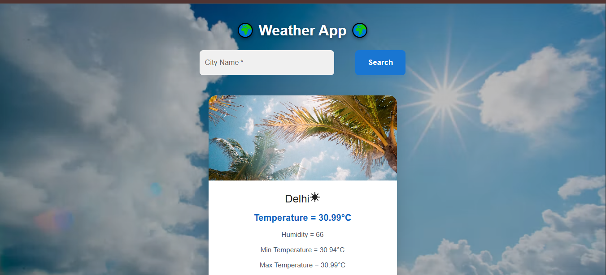
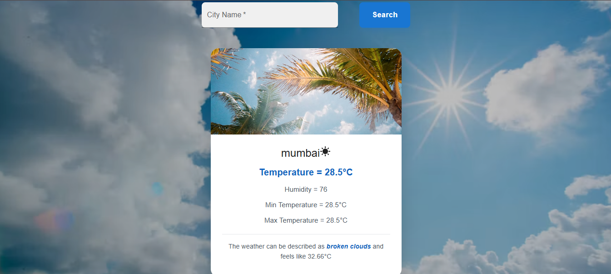

# 🌤️ React Weather App

A responsive weather application built with React.js that allows users to search for any city and view real-time weather information.

The application dynamically changes the background and weather card image based on the current weather condition, such as sunny, cloudy, rainy, etc.

## ✨ Features

- 🔍 Search weather by city name
- 🌡️ Current temperature
- 💧 Humidity
- 🤗 Feels-like temperature
- 🔥 Maximum temperature
- ❄️ Minimum temperature
- ☁️ Weather condition
- 🖼️ Dynamic background based on weather
- 🌦️ Dynamic weather card image
- ⚡ Real-time weather data using Weather API
- ❌ Handles invalid city/search errors
- 📱 Responsive design

## 🌦️ Dynamic Weather UI

The application changes its visual appearance according to the weather condition.

For example:

- ☀️ Sunny / Clear → Sunny background and card image
- ☁️ Cloudy → Cloudy background and card image
- 🌧️ Rainy → Rainy background and card image


## 📊 Weather Information

After searching for a city, the application displays:

- City name
- Temperature
- Humidity
- Minimum temperature
- Maximum temperature
- Feels-like temperature
- Current weather description

## 🛠️ Technologies Used

- React.js
- JavaScript
- HTML5
- CSS3
- Weather API
- Axios / Fetch API

## 📸 Screenshots

### Home Page


### Weather Result


## ⚙️ Installation

Clone the repository:
```
git clone https://github.com/YOUR-USERNAME/react-weather-app.git
```
### 2. Go to the project directory
```
cd react-weather-app
```

### 3. Install dependencies
```
npm install
```
### 4. Create a `.env` file

Create a `.env` file in the root directory of the project and add your weather API key:
```
VITE_WEATHER_API_URL=your_api_url
VITE_WEATHER_API_KEY=your_api_key
```

### 5. Start the development server
```
npm run dev
```
The application will run at:
```
http://localhost:5173
```
## 🔑 API Configuration

This project uses a weather API to retrieve real-time weather data.

> ⚠️ Do not upload your `.env` file to GitHub.

Make sure `.env` is included in your `.gitignore` file:
```
.env
.env.local
```
## 📁 Project Structure

```
react-major-prj-weather-api/
│
├── public/
│   └── screenshots/
│       ├── Home-page.png
│       └── weather-result.png
│
├── src/
│   ├── App.css
│   ├── App.jsx
│   ├── index.css
│   ├── InfoBox.css
│   ├── InfoBox.jsx
│   ├── main.jsx
│   ├── MaterialUI.jsx
│   ├── SearchBox.css
│   ├── SearchBox.jsx
│   └── WeatherApp.jsx
│
├── .env
├── .gitignore
├── eslint.config.js
├── index.html
├── package-lock.json
├── package.json
└── vite.config.js
```


## 🚀 How It Works

1. Enter a city name in the search box.
2. Click the **Search** button.
3. The application requests weather data from the API.
4. The weather information is displayed in a card.
5. The background and weather card image automatically change according to the weather condition.

## 🎯 Purpose

This project was created to practice:

- React components
- React state management
- API integration
- Async/Await
- Conditional rendering
- Dynamic styling
- Responsive CSS
- Error handling

## 👨‍💻 Author

**Your Name**
```
GitHub: https://github.com/PANKAJ-RAUNIYAR-6/react-weather-app.git
```
